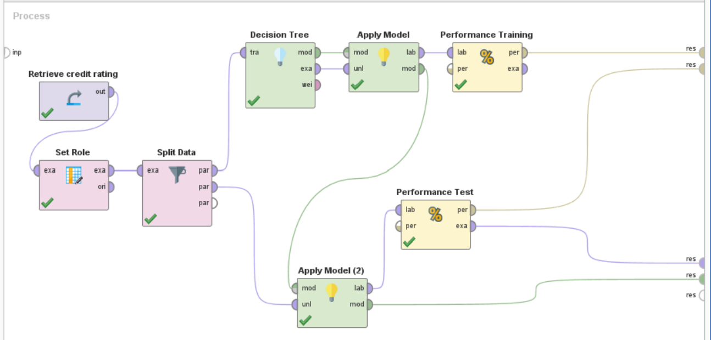

**Hello! Thank you so much for visiting my public portfolio. I am sifting through many old projects and updating my portfolio during my free time between classes and work, therefore please excuse possible errors.** 

# Portfolio
---
## Data Science

### City of SF Vehicle Collisions and Weather Conditions

 

**Tools/Techniques:** Python (Matplotlib, NumPy, Panda, SkLearn)     

This project aims to draw the connection between transportation crashes occurred in the city of San Francisco and the weather forecasts in the same area. The hypothesis is that inclement weather lead to higher traffic accidents in certain areas of the city.

 

### Avocado Price Prediction

**Tools/Techniques:** SAS JMP, Excel
    
In recent years, avocado prices and sales volume have been on the rise in multiple US markets. I wanted to assess the Avocado pricing data based on consumer demand as it can be helpful to predict the future prices. Applied multiple regression analysis using data collected from [**Hass Avocado Board**](https://www.kaggle.com/datasets/neuromusic/avocado-prices) between 2015 and 2020. 
    

 

 

### Credit Risk Prediction

**Tools/Techniques:** RapidMiner, Decision Tree Model

The objective of this exercise is to use a decision tree model to predict the credit rating of customers (Bad or Good) based on various attributes to help bank managers decide about loan applicant

 

### Hotel Booking Cancellation Prediction

**Tools/Techniques:** RapidMiner, Decision Tree Model
  
In the online booking industry, the cancellation rate for booking is high. When a reservation is cancelled, nothing can be done which creates issues for the institution itself. This has created a need to take precautions by predicting cancellations.
My analysis aimed to find a solution that can predict reservations that can be cancelled and then prevent the cancellations from happening in order to create a surplus value for the institution

 

 

### Boston House Price Prediction

**Tools/Techniques:** RapidMiner, Linear Regression

A business case report on a regression model I applied to predict the price of houses based on some specific features. Data was extractred from [**Kaggle**](https://www.kaggle.com/datasets/altavish/boston-housing-dataset).

 

 

---

## Data Visualization

### Call Center Dashboard

    
Data by [**Mark Bradbourne**](https://data.world/markbradbourne/rwfd-real-world-fake-data)
    
 

### HR Dashboard

 

            

### TED Talks: A Hero's Journey of Persuasion

TED talk dashboard created as a group project lead by me for a graduate visualization class
       

 

---

## Database Design

### Elite Model Management

**Tools/Techniques:** SQLServer

I created a database to store records for a fake modeling agency called Elite Model Management.

 

 
