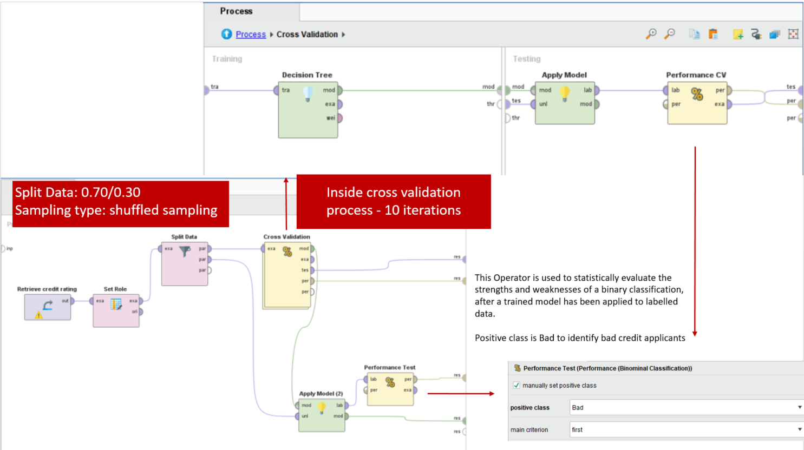

# Hello! Thank you so much for visiting my public portfolio. Please check back soon! 
At this time, please check out my social medias and resume on the right

# Portfolio
---
## Data Science

### City of SF Vehicle Collisions and Weather Conditions

 

This project aims to draw the connection between transportation crashes occurred in the city of San Francisco and the weather forecasts in the same area. The hypothesis is that inclement weather lead to higher traffic accidents in certain areas of the city.

 
 

### Avocado Price Prediction

**Tools:** SAS JMP, Excel
    
In recent years, avocado prices and sales volume have been on the rise in multiple US markets. I wanted to assess the Avocado pricing data based on consumer demand as it can be helpful to predict the future prices. Applied multiple regression analysis using data collected from [**Hass Avocado Board**](https://www.kaggle.com/datasets/neuromusic/avocado-prices) between 2015 and 2020. 
    

 

 

### Credit Risk Prediction

**Tools:** RapidMiner, Decision Tree Model

The objective of this exercise is to use a decision tree model to predict the credit rating of customers (Bad or Good) based on various attributes to help bank managers decide about loan applicant

 

 

### Hotel Booking Cancellation Prediction

**Tools:** RapidMiner, Decision Tree Model
  
In the online booking industry, the cancellation rate for booking is high. When a reservation is cancelled, nothing can be done which creates issues for the institution itself. This has created a need to take precautions by predicting cancellations.
My analysis aimed to find a solution that can predict reservations that can be cancelled and then prevent the cancellations from happening in order to create a surplus value for the institution

 

 

### Boston House Price Prediction

**Tools:** RapidMiner, Linear Regression

A business case report on a regression model I applied to predict the price of houses based on some specific features. Data was extractred from [**Kaggle**](https://www.kaggle.com/datasets/altavish/boston-housing-dataset).

 

 

---

## Data Visualization

### Call Center Dashboard

Data by [**Mark Bradbourne**](https://data.world/markbradbourne/rwfd-real-world-fake-data)
    

 

<noscript></noscript><object class='tableauViz'  style='display:none;'><param name='host_url' value='https%3A%2F%2Fpublic.tableau.com%2F' /> <param name='embed_code_version' value='3' /> <param name='site_root' value='' /><param name='name' value='CallCenterDashboard_16710827929470&#47;Final' /><param name='tabs' value='no' /><param name='toolbar' value='yes' /><param name='static_image' value='https:&#47;&#47;public.tableau.com&#47;static&#47;images&#47;Ca&#47;CallCenterDashboard_16710827929470&#47;Final&#47;1.png' /> <param name='animate_transition' value='yes' /><param name='display_static_image' value='yes' /><param name='display_spinner' value='yes' /><param name='display_overlay' value='yes' /><param name='display_count' value='yes' /><param name='language' value='en-US' /></object>

 

### HR Dashboard

    
    

 

<noscript></noscript><object class='tableauViz'  style='display:none;'><param name='host_url' value='https%3A%2F%2Fpublic.tableau.com%2F' /> <param name='embed_code_version' value='3' /> <param name='site_root' value='' /><param name='name' value='HRDashboard_16684642883090&#47;Dashboard1' /><param name='tabs' value='no' /><param name='toolbar' value='yes' /><param name='static_image' value='https:&#47;&#47;public.tableau.com&#47;static&#47;images&#47;HR&#47;HRDashboard_16684642883090&#47;Dashboard1&#47;1.png' /> <param name='animate_transition' value='yes' /><param name='display_static_image' value='yes' /><param name='display_spinner' value='yes' /><param name='display_overlay' value='yes' /><param name='display_count' value='yes' /><param name='language' value='en-US' /></object>
                
 

### TED Talks: A Hero's Journey of Persuasion

TED talk dashboard created as a group project lead by me for a graduate visualization class

    
    
    
    

 

<noscript></noscript><object class='tableauViz'  style='display:none;'><param name='host_url' value='https%3A%2F%2Fpublic.tableau.com%2F' /> <param name='embed_code_version' value='3' /> <param name='site_root' value='' /><param name='name' value='GroupTableauDashboard&#47;Dashboard1' /><param name='tabs' value='no' /><param name='toolbar' value='yes' /><param name='static_image' value='https:&#47;&#47;public.tableau.com&#47;static&#47;images&#47;Gr&#47;GroupTableauDashboard&#47;Dashboard1&#47;1.png' /> <param name='animate_transition' value='yes' /><param name='display_static_image' value='yes' /><param name='display_spinner' value='yes' /><param name='display_overlay' value='yes' /><param name='display_count' value='yes' /><param name='language' value='en-US' /></object>
                
 
---

## Database Design

### Elite Model Management

Levarging SQLServer, I created a database to store records for a fake modeling agency, Elite Model Management.

 

 
